# 阿比與土豆

     
<h2 align='center' style='font-style: italic; color: #5b4b42;'>獻給親愛的盈均</h2>

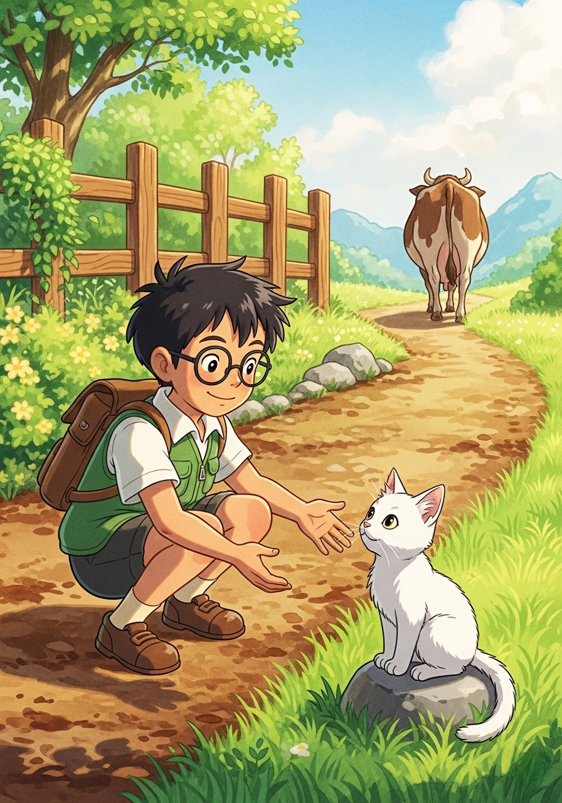

從前從前，有位熱愛冒險的小男孩叫阿比。因家中缺糧，他牽著家中唯一的一頭老牛去市場換錢。半路上遇到一位神祕老人，老人提議用名叫土豆的小白貓交換老牛。阿比看著土豆清澈的眼神便心軟答應了。轉眼老人走遠，留下老牛離去的背影。阿比開心地抱起他的新夥伴。

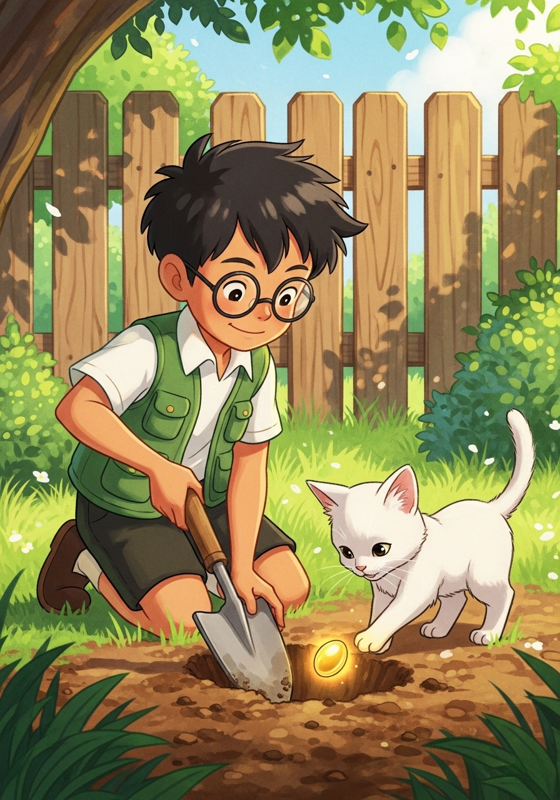

回到家後，土豆在院子裡的泥土地裡不停地挖掘著。突然，牠挖出了一顆閃爍著奇異光芒的種子。阿比心想：「這一定不是普通的種子！」於是，他帶著土豆一起把種子種在了泥土裡，並澆了一些水。

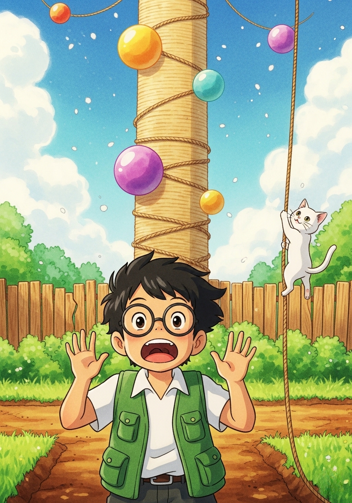

沒想到，那顆種子竟然在一瞬間快速生長，變成了一根巨大無比、直通雲霄的貓抓柱！貓抓柱上纏繞著柔軟的麻繩，還有許多色彩繽紛的小球吊飾。阿比驚訝地張大了嘴巴，向上仰望著這不可思議的景象。

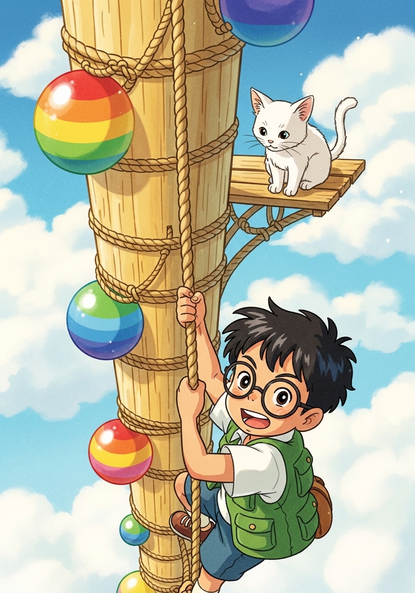

「土豆，等等我！」阿比趕緊抓緊貓抓柱上的麻繩，一步一步跟著往上爬。他們穿過了厚厚的雲層，風在耳邊呼呼地吹著。阿比雖然覺得有點高，但看著土豆勇敢的身影，他也鼓起了勇氣。

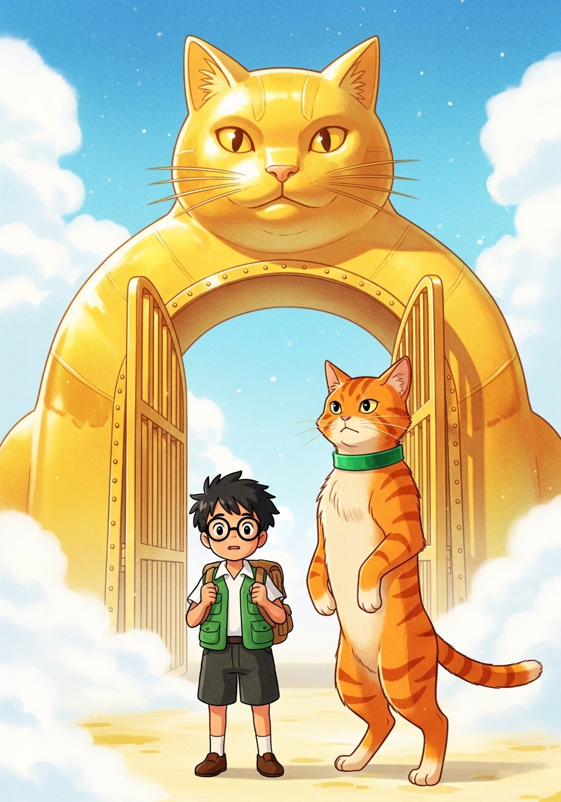

終於，他們來到了雲端上的世界。這裡有一座巨大的黃金貓頭大門。一位穿著綠色領子項圈、威風凜凜的橘色虎斑貓守衛擋住了去路。「我是守衛貓吉！」牠嚴肅地說，「這裡是貓貓國，普通人是不准進去的！」

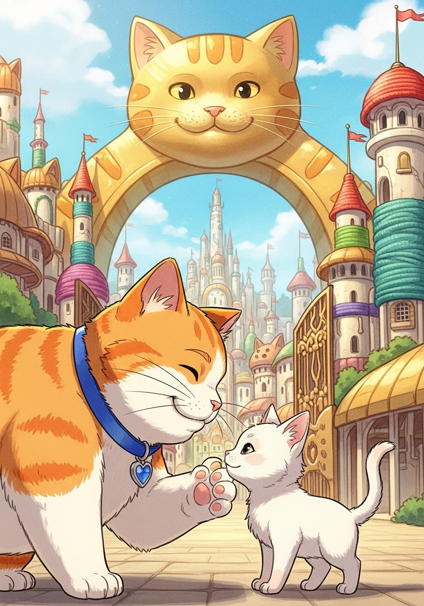

這時，一隻圓滾滾、橘白相間的胖貓大臣走了過來，牠戴著亮藍色的項圈，上面掛著心型裝飾，看起來非常和藹。牠就是大臣貓利。「別緊張，貓吉。」貓利對著土豆聞了聞，「這隻小白貓身上有皇室的氣息，快請他們進去吧！」

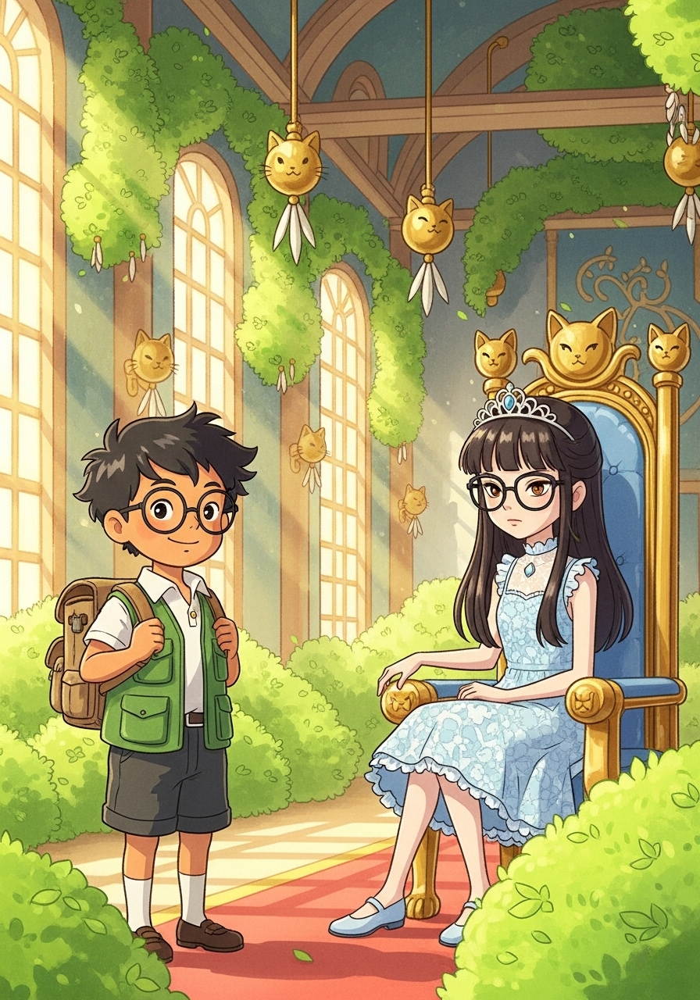

貓利帶領著阿比來到宮殿中心，在那裡，他們見到了貓貓國的女王——大貓貓。女王是一個穿著淡藍色洋裝、戴著圓框眼鏡的女孩。她優雅地坐在綴滿貓草的寶座上，臉上的神情卻顯得有些冷淡。

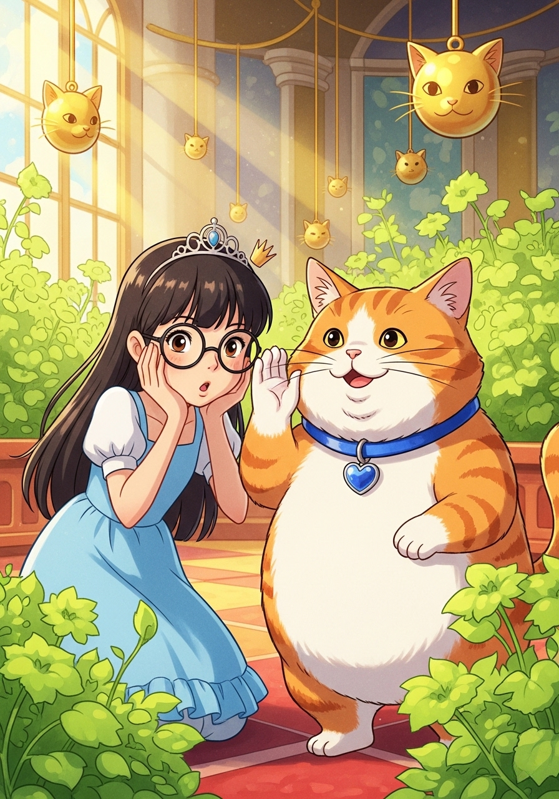

「人類，你來這裡做什麼？」大貓貓女王挑了挑眉毛。大臣貓利湊在女王耳邊輕聲解釋，這讓女王露出了驚訝的表情。「你是說，你為了這隻貓，竟然放棄了你珍貴的老牛？」

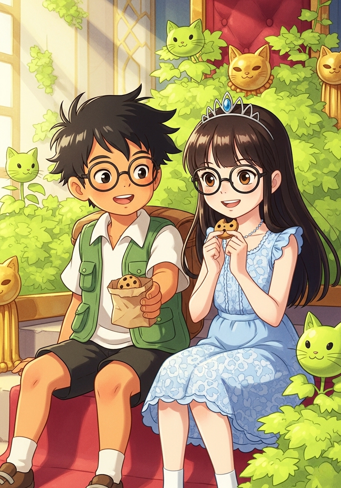

阿比從包包裡拿出一袋他在路上採集到的美味小餅乾，溫柔地分了一些給女王。「我覺得土豆是我的好朋友，這比任何東西都重要。」阿比真誠地說。大貓貓女王看著阿比溫暖的笑容，冰冷的眼神漸漸融化了。

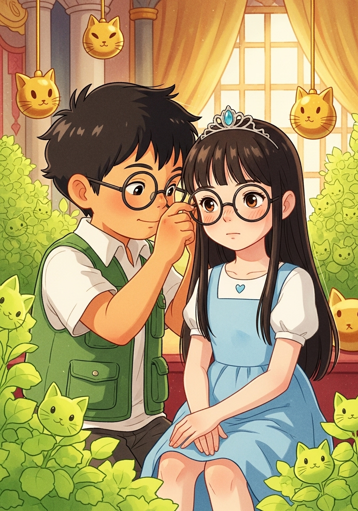

就在這時，女王的眼鏡不小心歪了。阿比溫柔地湊上前，用雙手輕輕幫她重新戴好眼鏡。「其實，住在雲端上很孤單吧？」阿比輕聲說。女王看著近在咫尺、眼神真誠的阿比，臉頰泛起了一抹紅暈，心中感到無比溫暖。

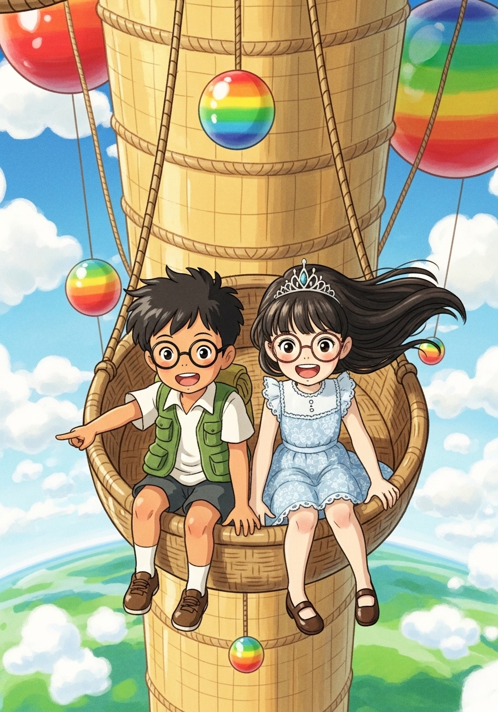

「我決定了！我要帶著大家一起回到地面！」大貓貓女王堅定地說。他們坐上了一個掛著彩虹裝飾的專屬藤編吊籃，阿比和女王舒舒服服地沿著巨大的貓抓柱慢慢降落下去。大家看著越來越近的綠色大地，都興奮地歡呼起來。

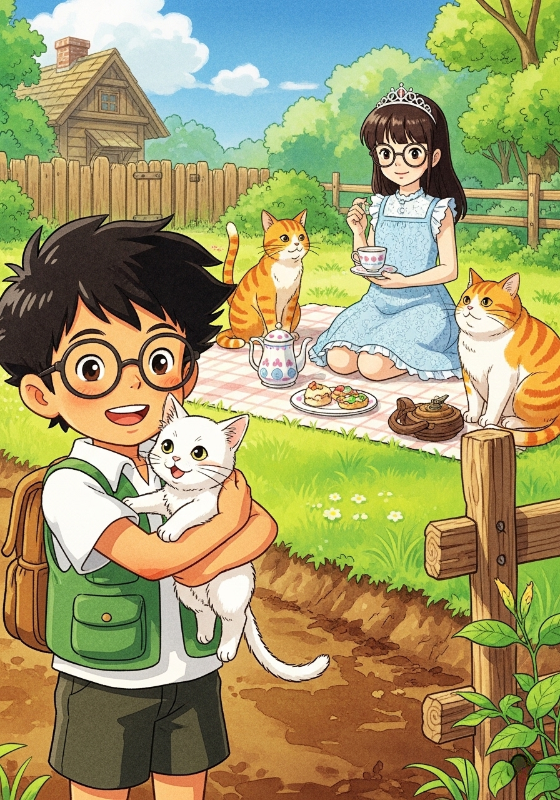

回到地面後，阿比的院子變得熱鬧無比。大家在草地上鋪了一塊野餐墊，舉辦起溫馨的下午茶派對！大貓貓女王優雅地端著茶杯，貓吉與貓利則開心地陪在一旁，而阿比則抱著土豆。阿比看著這群新朋友，心裡覺得雖然換掉了老牛，但他卻得到了一整個國家的溫暖與快樂。

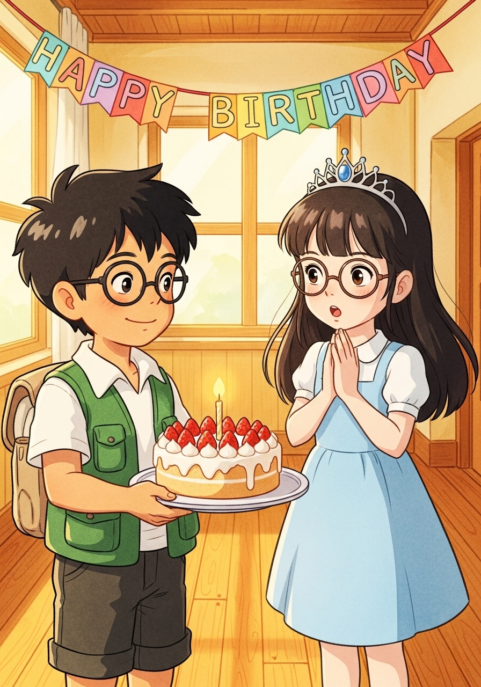

最特別的一天到了！阿比在溫馨的客廳裡為大貓貓準備了一個大驚喜。他端著一個插著蠟燭的精緻草莓蛋糕，溫柔地對著大貓貓微笑。大貓貓雙手合十放在胸前，臉上洋溢著驚喜與幸福的神情。

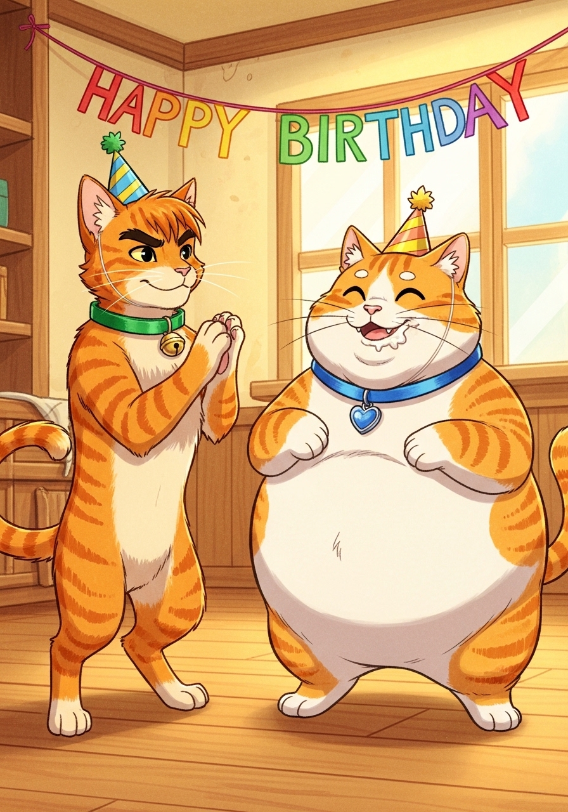

夥伴們也加入了這場派對！守衛貓吉和胖貓貓利都戴著彩色的小派對帽。貓利嘴巴邊還沾著一點鮮奶油，看起來垂涎三尺；貓吉則興奮地站在一旁，開心地拍動著肉球慶祝。

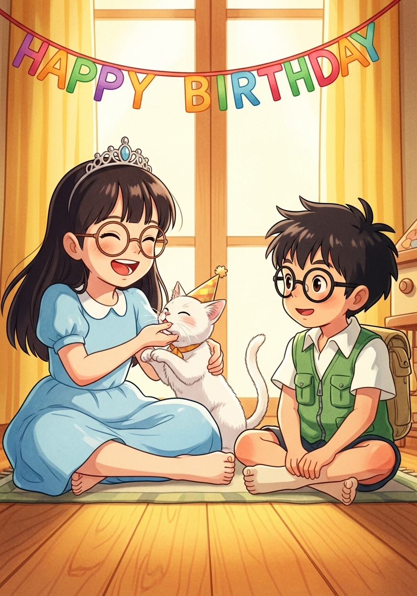

在雪白小貓土豆的陪伴下，大家一起唱著生日快樂歌。對阿比來說，能與大貓貓還有這群可愛的貓咪們在一起，就是最幸福的事。祝大貓貓生日快樂，我們要一直幸福下去喔！

